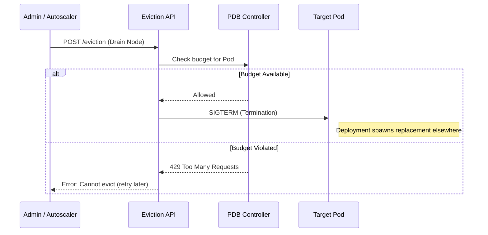

This is a refined version of your blog post. I have improved the technical accuracy (specifically regarding the Eviction API vs. the Scheduler), streamlined the structure, and removed redundant "Senior Engineer" tropes in favor of clear, actionable expertise.

---

# Don't Let `kubectl drain` Kill Your Production: A Guide to PodDisruptionBudgets

We’ve all been there: you’re performing a routine node upgrade on EKS or GKE. You run `kubectl drain`, and suddenly, your monitoring dashboard lights up red. Even though you have multiple replicas, Kubernetes evicted them all simultaneously.

The problem wasn't the scheduler—it was the lack of a contract. If you are running production workloads, **PodDisruptionBudgets (PDBs)** are that contract. They are the only way to tell the Kubernetes Eviction API: "You can move my pods, but only if you keep $X$ amount of them alive."

## Voluntary vs. Involuntary Disruptions

PDBs do not protect against everything. You must distinguish between two types of downtime:

1.  **Involuntary Disruptions (PDBs cannot help):** These are hardware failures, kernel panics, or cloud provider spot instance reclamations.
2.  **Voluntary Disruptions (PDBs are king):** These are triggered by humans or automation, including `kubectl drain`, Cluster Autoscaler scale-downs, or automated OS patching.

## How the Eviction API Works

When you drain a node, Kubernetes doesn't just "delete" pods. It calls the **Eviction API**. Unlike a standard deletion, an eviction request will fail if it violates a PDB.



---

## Deployment Strategies

There are two ways to define a PDB. Choosing the right one depends on your workload's scale.

### 1. The Scaling Web API (`minAvailable`)
For a frontend service with many replicas, you want to ensure a minimum percentage of capacity remains during maintenance.

```yaml
apiVersion: policy/v1
kind: PodDisruptionBudget
metadata:
  name: api-gateway-pdb
spec:
  minAvailable: 80%
  selector:
    matchLabels:
      app: api-gateway
```
**The Benefit:** Using percentages is more resilient than hard integers. If your Horizontal Pod Autoscaler (HPA) scales you from 10 to 100 pods, the PDB automatically adjusts to require 80 pods stay alive.

### 2. The Quorum-Based App (`maxUnavailable`)
For stateful systems like RabbitMQ, Zookeeper, or Consul, losing more than one node can break the cluster quorum.

```yaml
apiVersion: policy/v1
kind: PodDisruptionBudget
metadata:
  name: rabbitmq-pdb
spec:
  maxUnavailable: 1
  selector:
    matchLabels:
      app: rabbitmq
```
**The Benefit:** This guarantees that the Eviction API will only take down one pod at a time. It will wait for the replacement pod to be `Ready` before allowing the next eviction.

---

## Operations & CLI Mastery

### Auditing Your Budgets
The `ALLOWED DISRUPTIONS` column is your most important metric. It tells you exactly how many pods can be evicted *right now*.

```bash
kubectl get pdb -A
```

| NAMESPACE | NAME | MIN AVAILABLE | MAX UNAVAILABLE | ALLOWED DISRUPTIONS |
| :--- | :--- | :--- | :--- | :--- |
| prod | api-pdb | 80% | N/A | 2 |
| prod | mq-pdb | N/A | 1 | 1 |

*Note: If `ALLOWED DISRUPTIONS` is 0, a `kubectl drain` will hang until the cluster state changes.*

### Simulating an Eviction
Don't wait for a maintenance window to test your PDB. You can dry-run a node drain to see if your budgets hold up:

```bash
kubectl drain <node-name> --dry-run=client
```

---

## Troubleshooting: Why is my Drain Stuck?

When a node upgrade script hangs, a restrictive PDB is the culprit 90% of the time.

### The "Single Replica" Trap
**Symptom:** `kubectl drain` hangs forever on a specific pod.
**The Cause:** You have a Deployment with `replicas: 1` and a PDB set to `minAvailable: 1`.
**The Logic:** To evict the pod, the API asks "Will 1 pod remain?" Since only 1 exists, the answer is "No." The API blocks the eviction indefinitely.
**The Fix:** You cannot use a PDB on a single-replica deployment and expect automated drains to work. Either scale to 2 replicas or manually delete the pod to bypass the Eviction API.

### The Label Mismatch
**Symptom:** Pods are being deleted during a drain despite a PDB existing.
**The Cause:** The PDB `selector` doesn't match the labels on your Pods.
**The Fix:** Verify the match:
```bash
# Get PDB selector
kubectl get pdb <name> -o jsonpath='{.spec.selector.matchLabels}'
# Compare with Pod labels
kubectl get pods --show-labels
```

---

## Senior Best Practices

1.  **PDBs + Readiness Probes:** PDBs are useless if your Readiness Probes are poorly configured. If a pod reports "Ready" before it can actually handle traffic, the PDB will allow the next pod to be evicted, leading to a "ready" cluster that is actually failing.
2.  **Cluster Autoscaler Awareness:** The Cluster Autoscaler respects PDBs. If your PDB is too strict (e.g., `minAvailable` equals your current replica count), the Autoscaler cannot scale down underutilized nodes, leading to wasted cloud spend.
3.  **Don't PDB Everything:** Avoid PDBs in Dev/Staging environments for non-critical services. They can interfere with cost-saving tools like Descheduler or Karpenter.

## Summary Checklist

- [ ] **Match Labels:** Does the PDB selector match the Pod labels?
- [ ] **HPA Compatibility:** Are you using percentages for auto-scaled apps?
- [ ] **Quorum Safety:** Is `maxUnavailable` set to 1 for stateful clusters?
- [ ] **Redundancy:** Do you have at least 2 replicas for any pod protected by a PDB?

PDBs are the "seatbelts" of Kubernetes maintenance. They may feel like a nuisance when they block a drain, but they are exactly what prevents a routine update from becoming an incident report.
