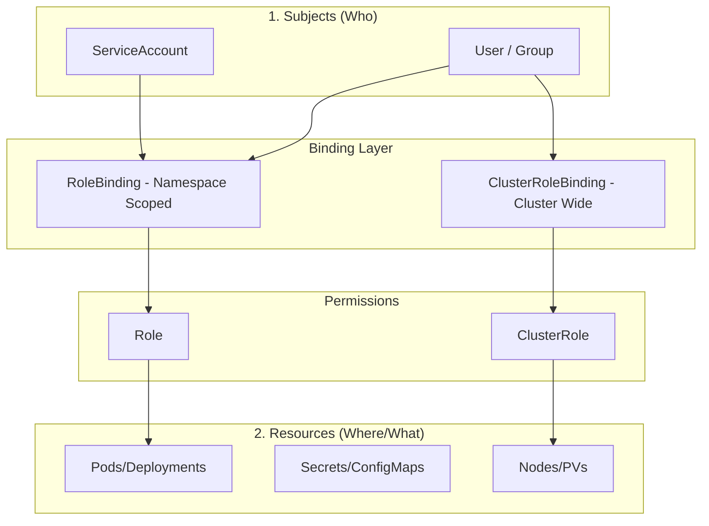

This is a strong technical post. To improve it, I have tightened the prose, corrected a few technical nuances (specifically regarding Secret access and Webhooks), and improved the visual hierarchy to make it more "skimmable" for a senior audience.

---

# Beyond "Get, List, Watch": A Senior DevOps Guide to Kubernetes RBAC

Most tutorials teach you how to grant `cluster-admin` and call it a day. In production, that is security debt that eventually gets foreclosed by a ransomware attack or a junior dev running `kubectl delete ns` in the wrong terminal tab.

This guide skips the "What is RBAC" fluff. Instead, we explore three high-stakes patterns used in enterprise environments and the troubleshooting workflows that keep your clusters secure.

---

## The RBAC Mental Model

RBAC is the glue between **Subjects** (Who), **Operations** (What), and **Resources** (Where).



---

## Scenario 1: The "Restricted" Namespace Developer
**Requirement:** Allow a developer to manage the `billing` namespace with two caveats: they cannot view Secret values, and they cannot delete the namespace itself.

### The Implementation
We use a `Role` because the scope is limited to a single namespace.

```yaml
# developer-role.yaml
apiVersion: rbac.authorization.k8s.io/v1
kind: Role
metadata:
  namespace: billing
  name: billing-dev-limited
rules:
- apiGroups: ["", "apps", "batch"]
  resources: ["pods", "deployments", "jobs", "services", "configmaps"]
  verbs: ["get", "list", "watch", "create", "update", "patch", "delete"]
- apiGroups: [""]
  resources: ["pods/log", "pods/exec"]
  verbs: ["get", "create"] # 'create' is required for the exec sub-resource
- apiGroups: [""]
  resources: ["secrets"]
  verbs: ["list", "watch"] # Can see that secrets exist, but cannot 'get' (read) content
```

**Senior Tip:** Note the `pods/exec` sub-resource. Without the `create` verb on the sub-resource, `kubectl exec` will fail even if the user has full permissions on the parent Pod. Also, by omitting `get` on `secrets`, the user can see names via `list`, but `kubectl get secret my-secret -o yaml` will be forbidden.

### Binding the User
```bash
kubectl create rolebinding billing-dev-binding \
  --role=billing-dev-limited \
  --user=jdoe@company.com \
  --namespace=billing
```

---

## Scenario 2: The "Template" Pattern for CI/CD
**Requirement:** A Jenkins ServiceAccount (in the `cicd` namespace) needs to deploy to `dev`, `staging`, and `prod`.

Instead of maintaining three identical Roles, use a **ClusterRole** combined with **RoleBindings** in each target namespace.

### 1. Define the ClusterRole (The Template)
```yaml
apiVersion: rbac.authorization.k8s.io/v1
kind: ClusterRole
metadata:
  name: cicd-deployer
rules:
- apiGroups: ["apps"]
  resources: ["deployments", "replicasets", "statefulsets"]
  verbs: ["get", "patch", "update"]
```

### 2. Bind it in the Production Namespace
```bash
kubectl create rolebinding jenkins-prod-binding \
  --clusterrole=cicd-deployer \
  --serviceaccount=cicd:jenkins-bot \
  --namespace=prod
```

**Why this is superior:** By using a `RoleBinding` to reference a `ClusterRole`, you grant the permissions **only** within the namespace of the binding. This keeps your RBAC DRY (Don't Repeat Yourself) while maintaining strict isolation.

---

## Scenario 3: Automated Permission Aggregation
**Requirement:** You need a "Global Auditor" role that automatically inherits permissions from any new Custom Resource Definition (CRD) added to the cluster (e.g., Istio, ArgoCD).

### The Implementation
Use **Aggregation Rules**. This is how Kubernetes' native `admin` and `edit` roles function.

```yaml
apiVersion: rbac.authorization.k8s.io/v1
kind: ClusterRole
metadata:
  name: global-auditor
aggregationRule:
  clusterRoleSelectors:
  - matchLabels:
      rbac.example.com/aggregate-to-auditor: "true"
rules: [] # The Control Plane controller-manager populates this
```

Now, when you install a new tool like Istio, you simply apply a small ClusterRole with the matching label:

```yaml
apiVersion: rbac.authorization.k8s.io/v1
kind: ClusterRole
metadata:
  name: auditor-istio-extension
  labels:
    rbac.example.com/aggregate-to-auditor: "true"
rules:
- apiGroups: ["networking.istio.io"]
  resources: ["virtualservices", "gateways"]
  verbs: ["get", "list"]
```
The `global-auditor` role automatically updates to include Istio permissions without manual intervention.

---

## Troubleshooting: When "Forbidden" Hits the Fan

### 1. The Impersonation Test
Don't ask the user for their kubeconfig. Use the `--as` flag to test permissions directly.

```bash
# Test if a user can delete pods in a specific namespace
kubectl auth can-i delete pods --as jdoe@company.com -n billing

# Test if the CI/CD bot can update deployments
kubectl auth can-i update deployments \
  --as system:serviceaccount:cicd:jenkins-bot \
  -n prod
```

### 2. Auditing Shadow Permissions
If a user has more access than intended, use `jq` to find the culprit binding:

```bash
kubectl get rolebindings,clusterrolebindings --all-namespaces -o json | \
  jq '.items[] | select(.subjects[]?.name=="jdoe@company.com") | {Binding: .metadata.name, Role: .roleRef.name, NS: .metadata.namespace}'
```

### 3. Verbose API Debugging
If `can-i` says "yes" but the application/CLI says "no," there is likely an API group or sub-resource mismatch. Increase verbosity to see the raw request:

```bash
kubectl apply -f deployment.yaml --as jdoe@company.com -v=8
```
*Level 8 exposes the HTTP Request URL (e.g., `/apis/apps/v1/...`). This reveals exactly which API group or sub-resource is being blocked.*

---

## Senior Level Checklist

1.  **Avoid `system:masters`:** This group bypasses the RBAC authorizer entirely. It cannot be restricted. Use the `cluster-admin` ClusterRole instead.
2.  **The "Discovery" Trap:** If `kubectl get pods` works but tab-completion fails, the user likely lacks `list/get` permissions on `api-resources` at the cluster level.
3.  **Modern ServiceAccount Tokens:** Since K8s 1.24, tokens are no longer auto-generated for ServiceAccounts. Use the `TokenRequest` API or manually create a Secret of type `kubernetes.io/service-account-token` for long-lived CI/CD integrations.
4.  **Implicit Deny:** RBAC is additive only. There is no "Deny" rule in Kubernetes RBAC. If two bindings overlap, the more permissive one wins.

**Final Thought:** Treat RBAC as code. Peer-review your YAMLs, audit them regularly with tools like `krane` or `rbac-lookup`, and always default to the Principle of Least Privilege.
